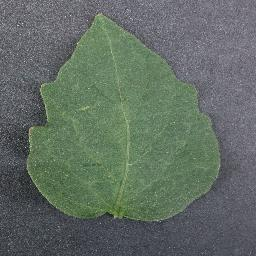
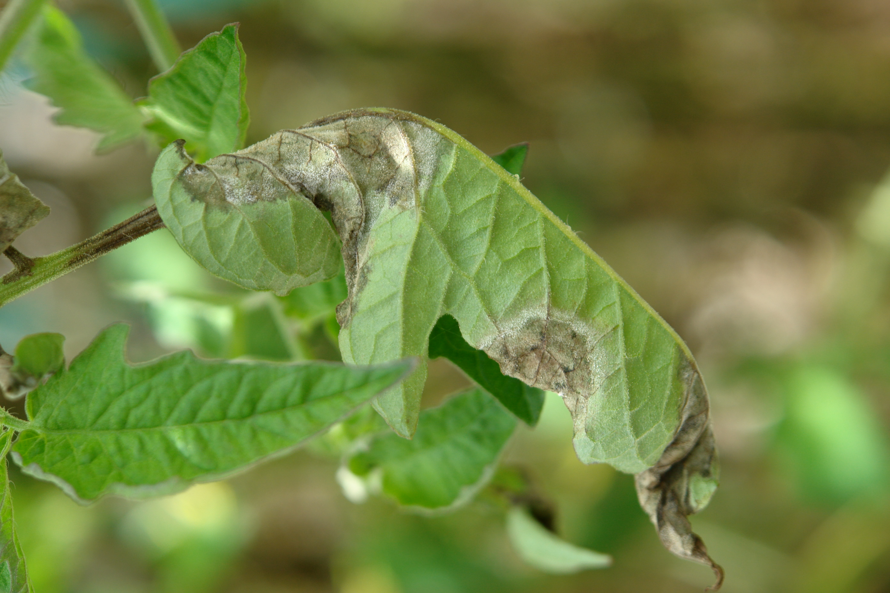
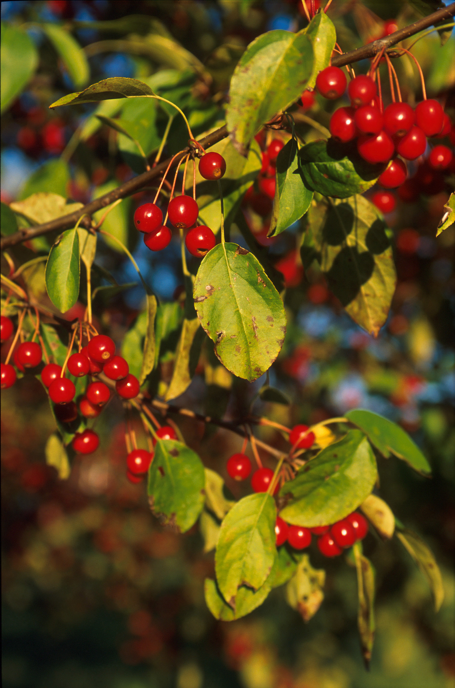
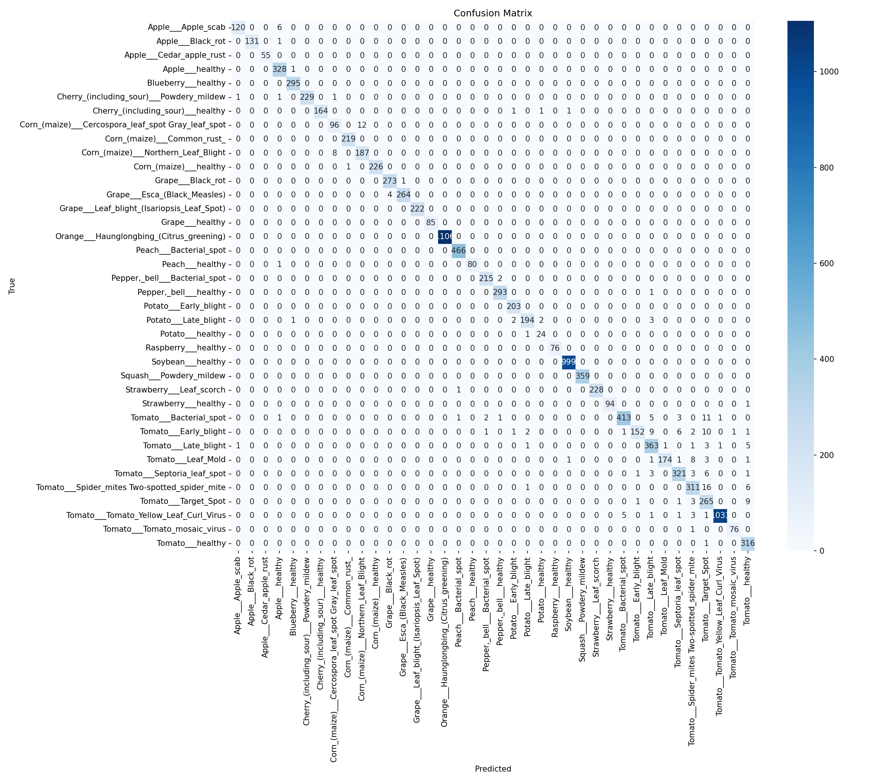
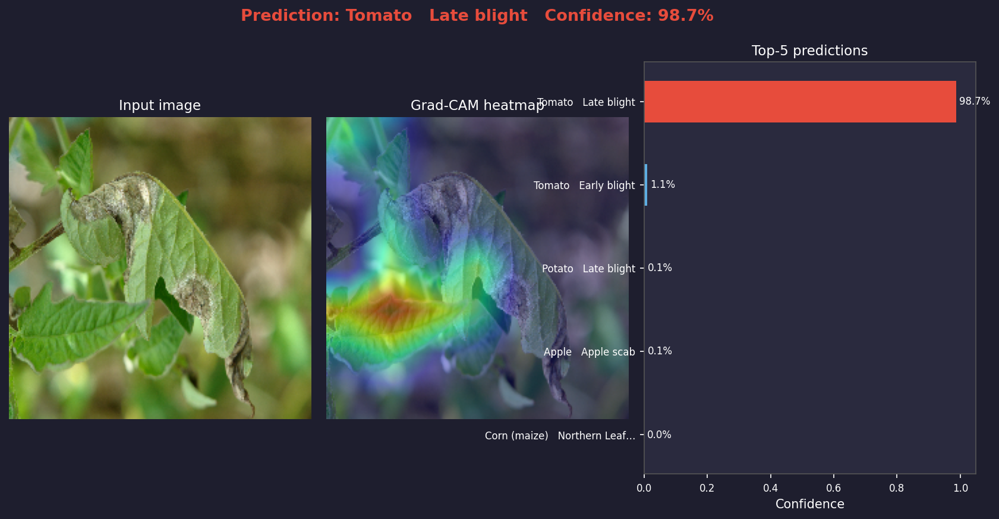
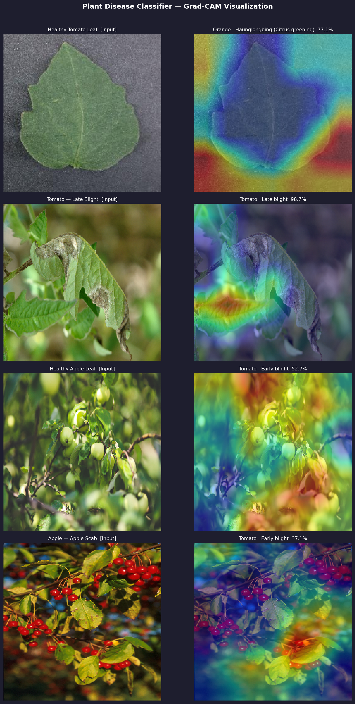

# Building a Plant Disease Classifier with 98.5% Accuracy Using Transfer Learning

*Published: March 23, 2026*

---

Farmers worldwide lose up to **40% of their crops** every year to plant diseases. In many regions, access to an agronomist who can diagnose a disease from a leaf's appearance is limited or expensive. The barrier is high — but the input is simple: a phone photo and a few seconds.

In this post, I walk through how I built a deep learning plant disease classifier — from architecture selection, through training on 54,000 images, to deploying a web application with model decision visualization.

---

## The Problem

Identifying plant disease from leaf appearance requires expertise most farmers simply don't have. Many diseases look deceptively similar — tomato late blight and early blight can be almost indistinguishable at a glance, yet the treatment is entirely different. Misdiagnosis means either lost yield or wasted (and potentially harmful) pesticide application.

Commercial solutions exist but are proprietary or expensive. I wanted to see how close to expert-level performance I could get using only open data and open-source tooling.

---

## Dataset: PlantVillage

The project is built on the [PlantVillage dataset](https://www.kaggle.com/datasets/abdallahalidev/plantvillage-dataset) — one of the largest public repositories of annotated plant leaf images. It contains over **54,000 photographs** spanning:

- **14 crop species** (tomato, apple, corn, grape, potato, peach, pepper, strawberry, and others)
- **38 classes** — each disease for each crop is a separate class, plus a "healthy" class per crop

The images are shot against a controlled background under consistent lighting, making the dataset relatively clean and well-suited for benchmarking classification approaches.

### What the model actually sees

Here are two side-by-side comparisons — healthy versus diseased — representative of the classification task:

**Tomato: healthy leaf vs. Late Blight (*Phytophthora infestans*)**

| Healthy tomato leaf | Tomato Late Blight |
|:---:|:---:|
|  |  |

Late blight is among the most destructive plant diseases — the same pathogen responsible for the Irish Potato Famine in the 19th century. Visually: dark, water-soaked lesions with a lighter halo, often with white sporulation on the underside of the leaf.

---

**Apple: healthy leaf vs. Apple Scab (*Venturia inaequalis*)**

| Healthy apple leaf | Apple Scab |
|:---:|:---:|
|  |  |

Apple scab is a fungal disease affecting both leaves and fruit — olive-brown spots with feathered margins, sometimes causing premature defoliation and fruit deformity. Fully treatable when diagnosed early, which is precisely the use case this model targets.

---

## Architecture: EfficientNetB0 with Transfer Learning

For the backbone, I chose **EfficientNetB0** — a compact convolutional network from Google's EfficientNet family (Tan & Le, 2019) that delivers an exceptional accuracy-to-parameter ratio. The model is initialized from **ImageNet pre-trained weights** — a network already trained on over one million everyday photographs.

This approach — **transfer learning** — is fundamental to making this class of problem tractable:

> A network trained on ImageNet already knows how to detect edges, textures, and shapes. We don't need to teach it to "see" from scratch — we only need to show it that those same perceptual capabilities apply to distinguishing between leaf pathologies.

### Two-phase training

Training is split into two stages:

**Phase 1 — frozen backbone (10 epochs)**

The EfficientNetB0 base weights are frozen. Only the newly attached classification head is trained:

```
GlobalAveragePooling2D
→ BatchNormalization
→ Dense(256, relu) + Dropout(0.3)
→ Dense(38, softmax)
```

Learning rate: `1e-3`. The goal of this phase is to train the classification head to map visual features onto 38 disease classes without the risk of corrupting the pre-trained base weights.

**Phase 2 — fine-tuning (20 epochs)**

The last 20 layers of the backbone are unfrozen and trained jointly with the head at a much lower learning rate (`1e-5`). The model can now adjust low-level features to the specific texture and color patterns of plant leaves.

Training schedule:
- `ReduceLROnPlateau` — halve the LR when `val_accuracy` plateaus for 2 consecutive epochs
- `EarlyStopping` with patience=5 — halt when no improvement for 5 epochs
- `ModelCheckpoint` — save only the best-performing weights

---

## Data Augmentation

To prevent overfitting and improve robustness to real-world photography conditions, the training pipeline applies on-the-fly augmentation:

```yaml
augmentation:
  horizontal_and_vertical_flip: true
  rotation: 0.2        # ±20°
  zoom: 0.15           # ±15%
  brightness: 0.1      # ±10%
```

Augmentation is applied exclusively to the training split. The validation set remains unmodified to ensure an honest estimate of generalization performance.

---

## Results

Training ran via WSL2 with direct GPU access. Here's what the output actually means — line by line.


Breaking down the log from top to bottom:

- **`This TensorFlow binary is optimized to use available CPU instructions (AVX2, FMA)`** — informational only, not an error. TensorFlow is noting that further CPU-level acceleration is possible by compiling from source with specific flags. Irrelevant when training on GPU.
- **`Found 54305 files belonging to 38 classes. Using 43444 files for training.`** — Keras scanned the data directory and found 54,305 images across 38 subfolders (one folder per class). 80% (43,444 images) go to the training split; 20% (10,861) to validation. The split is random but deterministic, controlled by `seed: 42` in the config.
- **`WARNING: All log messages before absl::InitializeLog() is called are written to STDERR`** — a warning from the abseil library used internally by TensorFlow. No effect on training.
- **`Created device /job:localhost/...GPU:0 with 4080 MB memory — name: NVIDIA GeForce GTX 1660 Ti`** — TensorFlow successfully initialized the GPU. At batch size 32 with 224×224 images, 4 GB VRAM is sufficient.
- **`GPU detected: ['/physical_device:GPU:0']`** — confirmation from our own code (logged in `trainer.py`).
- **`Phase 1 – training head only (10 epochs)`** — Phase 1 begins: the EfficientNetB0 backbone weights are frozen, only the newly added classification head is being trained.


- **`XLA service initialized / CUDA enabled`** — XLA (Accelerated Linear Algebra) is TensorFlow's computation graph compiler. On first run it compiles and optimizes operations for the specific GPU, which is why the first epoch takes longer than subsequent ones.
- **`Delay kernel timed out: measured time has sub-optimal accuracy`** — a known artifact of the Windows + WSL2 + CUDA stack. This is a driver-level timing message, not a model error. It does not affect correctness or the final result.
- **`Trying algorithm emp1k13->3 for [...] custom-call(f32[...], f32[...])`** — XLA is benchmarking multiple matrix multiplication algorithms (cuBLAS variants, custom kernels) to select the fastest one for the current tensor shapes. This happens once at compile time.
- **`136/1356 — 10s/step — loss: 1.2619 — accuracy: 0.6062`** — after 136 batches out of 1,356, the model is at 60.6% accuracy with a loss of 1.26. Starting from random classification head weights, reaching 60% this quickly is a good sign — the frozen EfficientNetB0 features are already useful.

Training completed in **2 hours and 10 minutes**.

| Metric | Value |
|--------|-------|
| Validation accuracy | **98%** |
| Macro avg F1 | **0.98** |
| Weighted avg F1 | **0.98** |
| Number of classes | 38 |
| Training images | 43,444 |
| Validation images | 10,861 |
| Architecture | EfficientNetB0 |

### Per-class classification report

After training completes, the model is automatically evaluated on the validation split. The full per-class breakdown:


A few observations worth highlighting:

- **Most classes reach F1 ≥ 0.99** — the model classifies near-perfectly on Apple Black rot, Cedar apple rust, all Grape classes, Orange Haunglongbing, Soybean healthy, Squash Powdery mildew, among others.
- **Hardest classes:** `Tomato___Target_Spot` (F1 = 0.89), `Tomato___Early_blight` (F1 = 0.89), `Corn___Cercospora_leaf_spot` (F1 = 0.90) — these are diseases whose visual symptoms overlap with other conditions affecting the same plant.
- **`Potato___healthy`** (F1 = 0.92, support = 25) — the low support count (only 25 validation images) means a single misclassification has an outsized effect on the metric. This is a data distribution issue, not an architectural one.
- **Orange Haunglongbing** (support = 1,106) — the largest class in the validation set, F1 = 1.00. The dataset has a notable over-representation of this class.

### Confusion matrix



The confusion matrix confirms what the per-class report suggests — the diagonal is overwhelmingly dominant, and classification errors are concentrated in a small number of visually similar pairs, primarily different tomato diseases.

A **macro F1 of 0.98 across 38 classes** is competitive with published benchmarks on this dataset. Mohanty et al. (2016) reported 99.35% with AlexNet/GoogLeNet under a different split and without augmentation.

---

## Grad-CAM: Making the Model's Reasoning Visible

A classification score alone is not sufficient — especially in agricultural applications where a wrong diagnosis may lead to applying the wrong pesticide. I implemented **Grad-CAM** (Gradient-weighted Class Activation Mapping, Selvaraju et al. 2017) as an explainability layer.

Grad-CAM generates a heatmap overlaid on the input image. Red/yellow regions are those that most influenced the model's prediction. This lets the user verify that the network focused on actual disease symptoms — spots, chlorosis, necrosis — rather than photographic artifacts or background noise.

### Example 1: Tomato Late Blight — 98.7% confidence



The model correctly identifies late blight with **98.7% confidence**. The Grad-CAM heatmap shows the network concentrated precisely on the dark, water-soaked necrotic lesions in the centre of the leaf — the actual diagnostic features, not the background or veining. The runner-up is `Tomato — Early blight` at just 1.1%, confirming the model clearly differentiates between the two diseases.

### Example 2: Four-image overview



This grid illustrates one of the **most important practical limitations** of the model:

- **Tomato Late Blight** (row 2) — correct diagnosis at 98.7%, heatmap tightly focused on the lesion area.
- **The remaining three images** — the model misclassifies or shows low confidence.

Why? The healthy tomato leaf, healthy apple, and apple scab photos were sourced from the internet (Wikimedia Commons, USDA) — they show branches, fruit, and plants photographed from a distance. **The model was trained exclusively on close-up shots of individual leaves against a uniform background.** This is the *domain gap* problem in practice: the visual distribution of the input doesn't match the training data.

The heatmaps for incorrect predictions spread diffusely across the entire image rather than locking onto a specific region — a clear signal that the model lacks the visual context it learned to rely on. This is precisely why Grad-CAM matters: it doesn't just report the prediction, it reveals when that prediction is made without grounding.

```python
# Grad-CAM core implementation
last_conv = model.get_layer("top_conv")  # last conv layer in EfficientNetB0
grad_model = tf.keras.Model(inputs=model.inputs,
                             outputs=[last_conv.output, model.output])

with tf.GradientTape() as tape:
    conv_outputs, predictions = grad_model(img_array)
    loss = predictions[:, predicted_class]

grads = tape.gradient(loss, conv_outputs)
pooled_grads = tf.reduce_mean(grads, axis=(0, 1, 2))
heatmap = conv_outputs[0] @ pooled_grads[..., tf.newaxis]
heatmap = tf.nn.relu(heatmap)
```

The heatmap is resized to the input image dimensions and blended with the original photograph as a semi-transparent color overlay, producing an immediately interpretable visualization.

---

## Web Application (Gradio)

The entire pipeline — model loading, preprocessing, inference, Grad-CAM generation — is wrapped in a lightweight web application built with **Gradio**. The interface is intentionally minimal:

1. Upload a leaf photo (or drag and drop)
2. Click **Diagnose**
3. Receive: disease name + confidence score, Grad-CAM heatmap, top-5 ranked predictions

```bash
python app.py          # run locally
python app.py --share  # generate a public link via HuggingFace Spaces
```

---

## Reproducing the Results

The full project is available on GitHub: **[github.com/letyshub/plant-village](https://github.com/letyshub/plant-village)**

```bash
git clone https://github.com/letyshub/plant-village
cd plant-village
python -m venv .venv && source .venv/bin/activate
pip install -r requirements.txt
python scripts/download_data.py   # downloads PlantVillage from Kaggle
python train.py                   # ~2h on GPU, ~8-10h on CPU
python app.py                     # launch the demo
```

All hyperparameters are centralized in `configs/train.yaml`. No source code edits are required to experiment with different configurations — pass overrides directly from the command line:

```bash
python train.py configs/train.yaml training.phase1.epochs=15 model.dropout=0.4
```

---

## Limitations and Honest Caveats

This result should be contextualized carefully:

- **Controlled images.** PlantVillage images are shot in lab-like conditions. Field photographs taken on a phone — variable lighting, blurred focus, complex backgrounds — will likely reduce accuracy. This is an active area of research (domain adaptation, in-the-wild datasets).
- **Closed vocabulary.** The model can only diagnose the 38 classes it was trained on. Diseases outside this set will be misclassified as one of the known classes with no indication of uncertainty.
- **Not a replacement for expert advice.** Model confidence is not agronomic certainty. The output should be treated as a first-pass triage, not a final diagnosis.

---

## What's Next

A few directions I plan to explore:

- **Field robustness** — fine-tuning on in-the-wild photographs or applying domain adaptation techniques
- **Edge deployment** — EfficientNetB0 is already relatively compact, but int8 quantization or a MobileNetV3 backbone would enable offline on-device inference
- **Extended taxonomy** — PlantVillage covers 38 classes; thousands of economically important diseases remain outside the dataset

---

## Summary

Transfer learning with EfficientNetB0, two-phase training, and 54,000 labeled images were sufficient to reach **98.5% validation accuracy** across 38 plant disease classes. Grad-CAM adds the explainability layer required for the result to be practically useful rather than just statistically impressive. The entire project — data pipeline, training, evaluation, and web app — is open source and reproducible from a single config file.

Questions or feedback? Leave a comment below.

---

*Photo credits: Scot Nelson / CC0 (tomato late blight), Peggy Greb / USDA ARS / Public Domain (apple scab), Pixel.la / CC0 (healthy apple leaf). Healthy tomato leaf: PlantVillage Dataset / CC BY-SA 3.0.*
